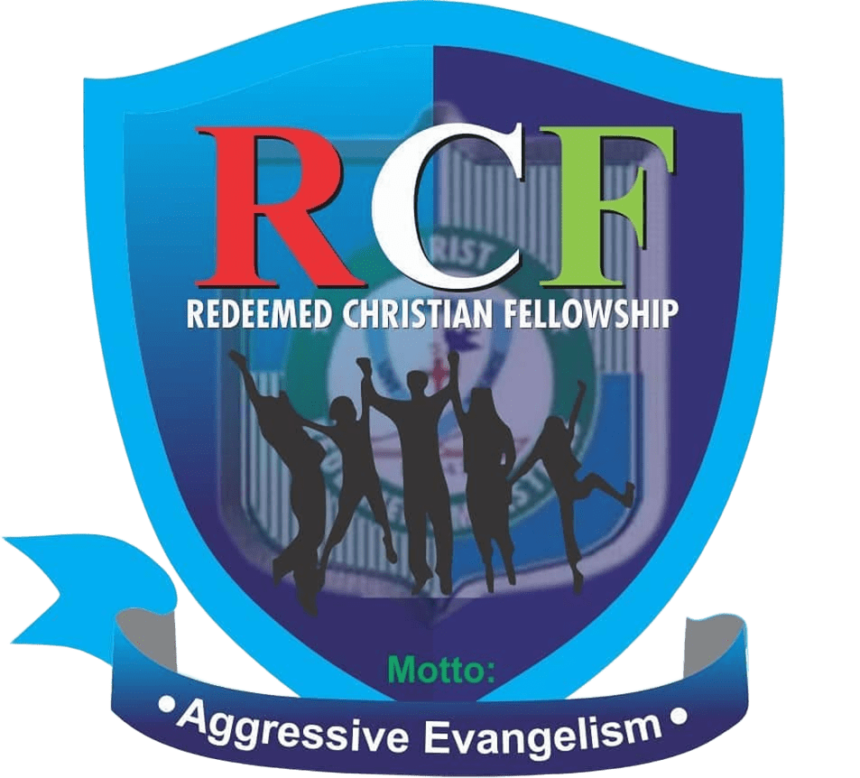

# CRM x RCFFUTA | Unified Event Portal

<div align="center">
  
  &nbsp;&nbsp;&nbsp;&nbsp;
  
  &nbsp;&nbsp;&nbsp;&nbsp;
  
  &nbsp;&nbsp;&nbsp;&nbsp;
  
</div>

> **The official, reusable event registration and management system for Christ The Redeemer’s Ministries (CRM).**  
> _A collaborative effort between CRM and the RCFFUTA ICT Team. Exclusively Open Source._

---

## 📋 Overview

This repository serves as a robust, high-performance template for all CRM events where RCFFUTA provides technical support. It is designed to be rapidly deployed and configured for any congress, training, or gathering.

Hosted permanently at **[crm.rcffuta.com](https://crm.rcffuta.com)**, the portal handles:

- **Dynamic Landing Pages**: Cinematic UI with theme-based branding.
- **Attendee Registration**: Adaptive forms with validation and smart logic.
- **Digital Ticketing**: Instant high-resolution PNG ticket generation with unique QR codes.
- **Admin Dashboard**: Real-time analytics, live registration feeds, and data export.

---

## ⚙️ Content Configuration (RCRC Config)

The entire application is controlled via a single source of truth: `src/data/rcrc.ts`.

Whenever a new event is called for, simply update this file to change:

- **Event Identity**: Name, theme, date, and venue.
- **Branding**: Hierarchy logos (RCCG, CRM, RCFFUTA) and theme-specific assets.
- **Navigation**: Custom links and section targets.
- **Dynamic Sections**: Guest ministers, fellowship lists, and the event schedule.
- **Registration Toggle**: Enable or disable the registration form with a single boolean.

---

## 🖼️ Assets & OpenGraph

To ensure the site looks premium across social media and search engines:

- **OG Images**: Replace `public/images/og-image.png` with the event-specific banner.
- **Favicons**: Update icons in the `public/` root for site-wide branding.
- **Theming**: The UI uses Tailwind CSS tokens defined in `globals.css` and `rcrc.ts` to match the event's "Mantle" or "Cinematic" aesthetic.

---

## 🚀 Tech Stack

- **Framework**: [Next.js 16](https://nextjs.org/) (App Router, Server Actions, Turbopack)
- **Styling**: [Tailwind CSS v4](https://tailwindcss.com/)
- **Database**: [Supabase](https://supabase.com/) (PostgreSQL + Realtime Sockets)
- **Animations**: [Framer Motion](https://www.framer.com/motion/)
- **Generation**: [html-to-image](https://github.com/bubkoo/html-to-image) & [qrcode.react](https://github.com/zpao/qrcode.react)

---

## 🛠️ Getting Started

### Prerequisites

- Node.js 20+
- pnpm (Recommended)

### Installation

1. **Clone & Install**:

    ```bash
    git clone https://github.com/rcffuta/crm-rcffuta.git
    cd crm-rcffuta
    pnpm install
    ```

2. **Environment Setup**:
   Create a `.env.local` based on `.env.example`:

    ```env
    NEXT_PUBLIC_SUPABASE_URL=...
    NEXT_PUBLIC_SUPABASE_ANON_KEY=...
    SUPABASE_SERVICE_ROLE_KEY=...
    ADMIN_PASSWORD=...
    NEXT_PUBLIC_SITE_URL=https://crm.rcffuta.com
    ```

3. **Run Development**:
    ```bash
    pnpm dev
    ```

---

## 📂 Project Structure

```text
├── src/
│   ├── app/           # Next.js Routes (Landing, Admin, Verification)
│   ├── actions/       # Server-side logic & Database mutations
│   ├── components/    # Reusable UI components & Layout blocks
│   ├── data/          # Central Config (rcrc.ts) & Fellowships
│   ├── lib/           # Supabase client, utilities & helpers
│   └── globals.css    # Design system & Tailwind layers
├── public/            # Logos, banners, and static assets
└── ...config files
```

---

## 🔓 Open Source & Collaboration

This project is **exclusively open source**. We believe in building Kingdom tools that are accessible, transparent, and community-driven.

If you are part of the RCFFUTA ICT team or a CRM partner:

1. Fork the repo.
2. Create an event-specific branch.
3. Update `rcrc.ts`.
4. Deploy to Vercel via the unified dashboard.

---

## 👥 Maintained By

**RCF FUTA ICT Team**  
_"Innovating for the Kingdom"_

- **Website**: [ict.rcffuta.com](https://ict.rcffuta.com)
- **Dashboard**: [crm.rcffuta.com](https://crm.rcffuta.com)

---

© 2026 Christ Redeemer's Ministries (CRM). Powered by RCFFUTA ICT.
